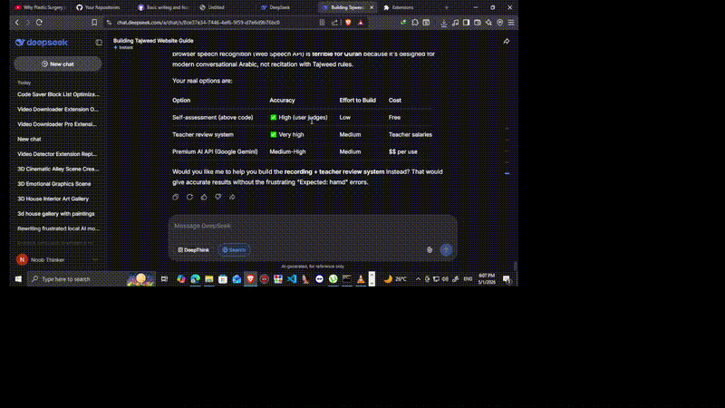

# 🎬 Code Saver + Block List - Browser Console Script

<div align="center">
  <a href="https://nokinnngsss">
    
  </a>
  
  <p>
    <strong>👆 Click to watch the demo video</strong><br>
    <em>See the script in action - from installation to saving code blocks</em>
  </p>
</div>

---

## 📋 Overview

A powerful browser console script that enhances code block interaction on any webpage. It automatically detects code blocks, identifies their programming language, and provides a floating UI with **save/download capabilities** and an **interactive block navigator**.

> **Perfect for:** ChatGPT users, documentation readers, tutorial followers, and developers who frequently save code snippets from the web.

---

## ✨ Features

### 🎯 Core Functionality
- **🔍 Auto-Detection**: Finds code blocks in Markdown, `<pre><code>`, and plain text
- **🗣️ Smart Language Detection**: Identifies 14+ programming languages using regex patterns
- **💾 One-Click Save**: Downloads code with correct file extension (`.py`, `.js`, `.cpp`, etc.)
- **📋 Block Navigator**: Floating panel to browse and jump to any code block on the page

### 🚀 Performance Optimized
- **Language Caching**: Each block's language is computed once and cached using `WeakMap`
- **Chunked Rendering**: List panel renders 15 items per animation frame (no UI freeze)
- **Streaming Support**: Watches for new blocks with `MutationObserver` (works with ChatGPT)
- **Limited Analysis**: Only analyzes first 3,000 characters for language detection
- **No Blinking**: Panel never auto-refreshes while open, keeping buttons stable

---

## 🎮 Quick Demo Preview

<div align="center">
  <table>
    <tr>
      <td></td>
      <td></td>
    </tr>
    <tr>
      <td align="center"><em>Paste in console (F12)</em></td>
      <td align="center"><em>💾 Save button appears automatically</em></td>
    </tr>
    <tr>
      <td></td>
      <td></td>
    </tr>
    <tr>
      <td align="center"><em>📋 Interactive block navigator</em></td>
      <td align="center"><em>💾 Downloads with correct extension</em></td>
    </tr>
  </table>
</div>

### The Flow:

1. **Paste the script** in your browser console (F12)
2. **Click ☰ LIST** to see all detected code blocks
3. **Hover over entries** to preview code snippets
4. **Click ↓ jump** to smoothly scroll to any block (highlighted in yellow)
5. **Click 💾 Save** on any block to download it with proper extension

---

## 🗣️ Supported Languages

The script automatically detects these languages from code patterns:

| Language | Extension | Detection Patterns |
|----------|-----------|-------------------|
| C++ | `.cpp` | `std::`, `cout`, `#include` |
| C | `.c` | `printf()`, `malloc()`, `.h includes` |
| Python | `.py` | `def`, `import`, `print()` |
| JavaScript | `.js` | `function`, `const/let`, `=>` |
| TypeScript | `.ts` | `interface`, `type`, `: string` |
| Java | `.java` | `public class`, `System.out` |
| HTML | `.html` | `<!DOCTYPE>`, tags |
| CSS | `.css` | Selectors, `@media` |
| SQL | `.sql` | `SELECT FROM`, `INSERT INTO` |
| Bash | `.sh` | `#!/`, `echo`, `if [` |
| PHP | `.php` | `<?php`, `$_GET/$_POST` |
| Ruby | `.rb` | `def...end`, `puts` |
| Go | `.go` | `package`, `func`, `:=` |
| Rust | `.rs` | `fn`, `let mut`, `println!` |

---

## 🚀 Quick Start

### Installation:

1. Open any webpage with code blocks
2. Press **F12** or **Ctrl + Shfit + j** to open Developer Console && remove restruction of pasting
3. Copy the entire script from [`code-saver.js`](code-saver.js)
4. Paste and press **Enter**

```javascript
// The script will automatically:
// - Show a ☰ LIST button
// - Add 💾 Save buttons to code blocks  
// - Display languages detected
